[AWS Backup](https://aws.amazon.com/backup/) enables you to centralize and automate data protection across AWS services. AWS Backup offers a cost-effective, fully managed, policy-based service that simplifies data protection at scale. Together with AWS Organizations, AWS Backup enables you to [deploy data protection (backup) policies centrally](https://aws.amazon.com/blogs/storage/managing-backups-at-scale-in-your-aws-organizations-using-aws-backup/). You can configure, manage, and govern backup activity across AWS Regions and accounts. AWS Backup also helps you support your regulatory compliance obligations and meet your business continuity goals. 

With ransomware a top concern for customers, backups are essential to data recovery and business continuity. [AWS Backup Vault Lock](https://docs.aws.amazon.com/aws-backup/latest/devguide/vault-lock.html) adds security measures that store backups using the write-once, read-many (WORM) model, providing immutability to recover from accidental or malicious deletions. 

In this tutorial, we provide step-by-step guidance on how to use AWS Backup Vault Lock to make backup vaults WORM compliant.

### Prerequisites

Before starting this tutorial, you will need the following:

| Attributes                |                                   |
| ------------------- | -------------------------------------- |
| ✅ AWS Level        | Intermediate - 200                         |
| ⏱ Time to complete  | 30 minutes                             |
| 💰 Cost to complete | You are [billed for the backup storage](https://aws.amazon.com/backup/pricing/) as per the cost of the resources you are protecting. AWS Backup Vault lock is an optional feature and there is no additional charge for making use of the AWS Backup Vault Lock feature   |
| 🧩 Prerequisites    | An [AWS account](https://aws.amazon.com/premiumsupport/knowledge-center/create-and-activate-aws-account/). For more information on using AWS Backup for the first time, view the [AWS Backup documentation](https://docs.aws.amazon.com/aws-backup/latest/devguide/setting-up.html).   A supported resource by AWS Backup. For this tutorial, I am making use of an EBS volume. For AWS Backup supported resources, refer to the [AWS Backup supported resources page.](https://docs.aws.amazon.com/aws-backup/latest/devguide/whatisbackup.html#supported-resources)  IAM roles used by AWS Backup to create a backup of an EBS volume.  If a subsequent role is not created, then the default IAM role can be used — **AWSBackupDefaultRole**.                    |
| 📢 Feedback| <a href="https://pulse.buildon.aws/survey/DEM0H5VW" target="_blank">Any feedback, issues, or just a</a> 👍 / 👎 ?    |
| ⏰ Last Updated     | 2023-01-10                             |

| ToC |
|-----|

**What you will accomplish**

 In this tutorial, you will:

* Create a AWS Backup Vault. A vault is a logical container where the backups are stored.

* Create AWS Backup Vault Lock to protect your backups from accidental or malicious deletion by any user or role including “Root.”   

* Create an on-demand backup of an Amazon EBS volume with AWS Backup to demonstrate the AWS Backup Vault Lock Feature.
        

## Implementation
### Step 1: Go to the AWS Backup console 
**1.1 - Sign in**

* Log in to the [AWS Management Console](https://console.aws.amazon.com/), and open the [AWS Backup console](https://console.aws.amazon.com/backup).

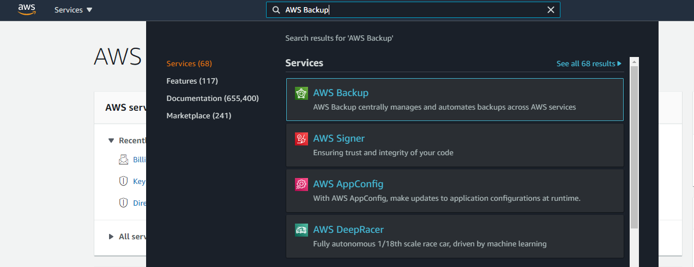

### Step 2: Create an AWS Backup Vault to store the backups

Now that you are in the AWS Backup console, you create a backup vault to protect your resources. 

**2.1 - Create AWS Backup Vault**

* Under the **My account** section, select **Backup Vaults**. Then, select **Create Backup vault.**

* Enter a **name** for your backup vault. You can name your vault to reflect what you will store in it, which will also make it easier to search for the backups you need. For example, you could name it WORM_Vault.
* Select an **AWS Key Management Service (AWS KMS) key**. You can use either use a KMS key that you already created or select the default AWS Backup KMS key.
* Optionally, add tags that will help you search for and identify your backup vault.
* Select **Create Backup Vault**.

### Step3: Create Backup Vault lock
Once your backup vault is created in Step2, you will be in the vault details page. From here, you can create the vault lock. 

**3.1 - Create vault lock**
*  Select **Create vault lock,** choosing **Create vault lock** opens a new page to configure the vault lock.
    

* Alternatively, you can also go to the AWS Backup console in the navigation pane on the left and select **Backup vault locks** and then **Create vault lock** to create a backup vault lock.
                    

**3.2 - Configure vault lock settings**

* In the pane **Vault lock details**, choose which vault to which you want your lock applied. 
        
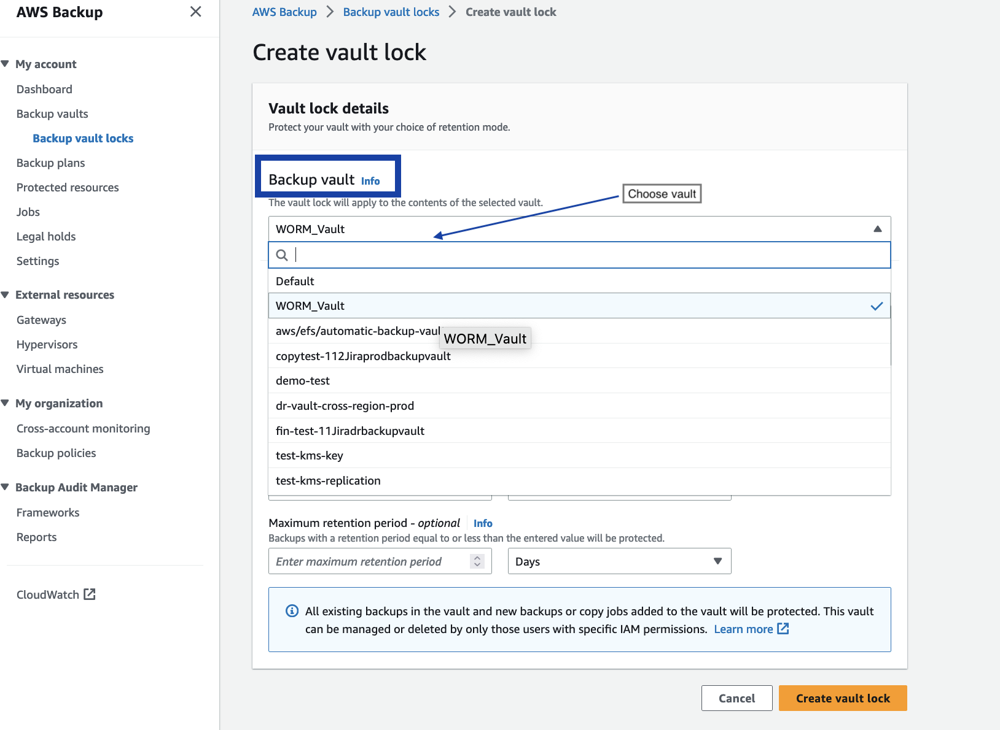

* Under **Vault lock mode** choose the mode to be applied to the vault.
        
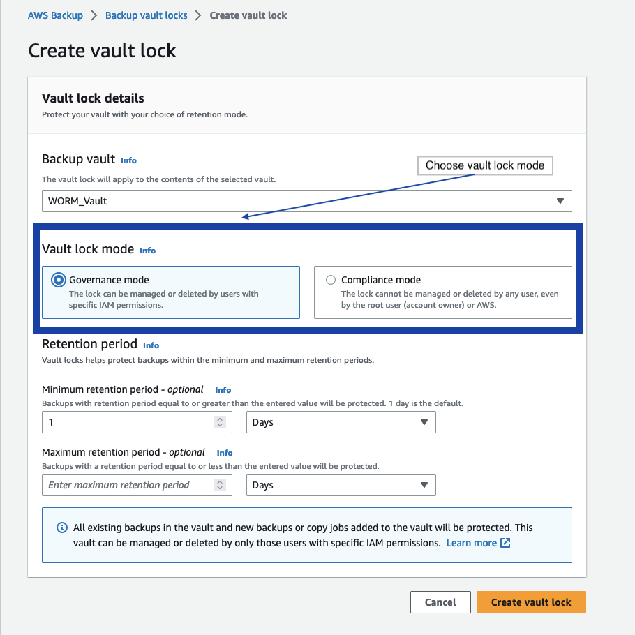

* Vaults locked in **governance mode** can have the lock removed by users with sufficient IAM permissions. While vaults locked in **compliance mode** *cannot be deleted* once the cooling-off period ("**grace time**") expires. During grace time, you can still remove the vault lock and change the lock configuration.

**Note:** AWS Backup Vault Lock is a valuable tool for protecting your data backup assets and making sure that your backup vault meets strict governance requirements. As part of the AWS Shared Responsibility Security model, customers must properly classify their backup and determine the appropriate retention policies that should be applied to them. Once a vault is locked in compliance mode, the backups in that vault can’t be deleted before the retention period expires. And no one, including the customer, root account or AWS, can change the locked retention period settings in Complaince mode.

* For this tutorial, we will be using compliance mode.
                
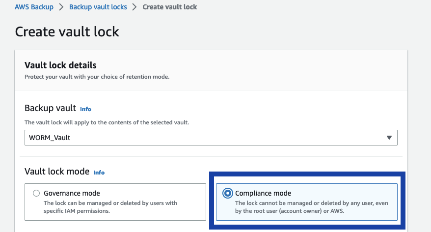

* For the **Retention period**, choose the minimum and maximum retention periods (retention periods are *optional*). Only backup jobs within the retention periods will be successful.

**Note:** **retention period** is the time, measured by days, a backup is retained. Your vault lock will protect backups in the vault that contain values equal or between the minimum and maximum retention periods.The minimum retention period is the amount of time you choose to retain your data. Backup and copy jobs to this vault with retention periods less than this value will fail. Backup and copy jobs to this vault with lifecycle retention periods greater than the specified maximum retention period will fail.

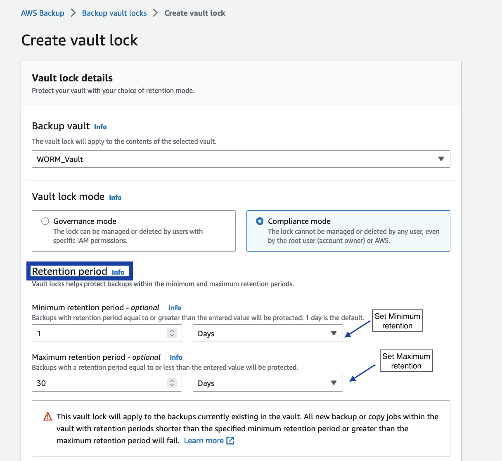

* As we chose compliance mode, a section called **Compliance mode start date** is shown. If you chose Governance mode, this will not be displayed, and this step can be skipped.

**Note:** Vault locks in compliance mode have a period of time between the vault lock creation and when the vault lock is no longer changeable. This countdown period is called grace time. **Grace time** is the period after a vault lock is activated in compliance mode that it can still be removed before becoming immutable. The minimum grace time duration must be *at least* three days (72 hours) from the date the vault lock is created (maximum is 100 years).

* Choose the **Create vault lock** button. This takes you to the conformation page.
        
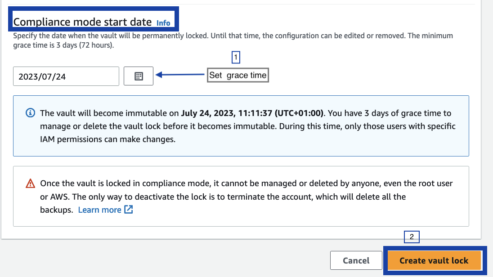

* Confirm and acknowledge that you concur that the configuration is accurate after typing **confirm** in the text box to confirm that you wish to establish this lock in the chosen mode.

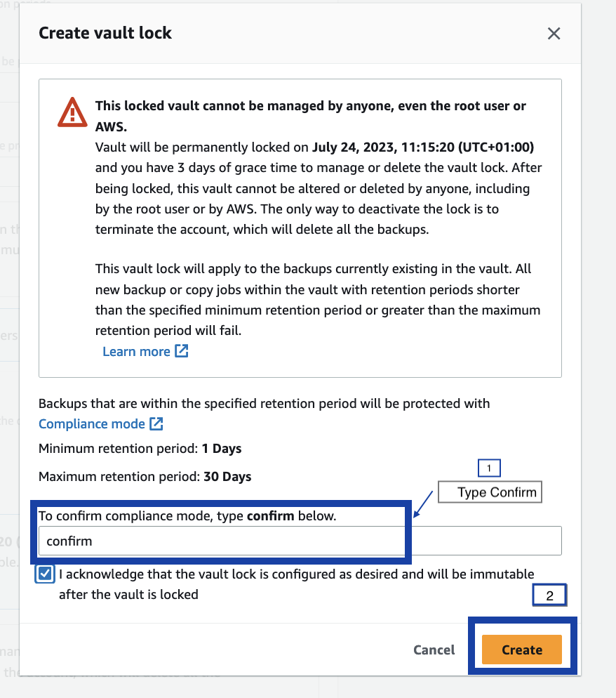

* Once you are satisfied with the configuration, choose **Create** to create the vault lock.

**Step 3.3 View Vault lock**

* Once the vault lock is created it is visible under **Backup Vault lock.** A banner is also displayed providing details on the recently created vault lock created in Step 3.2.

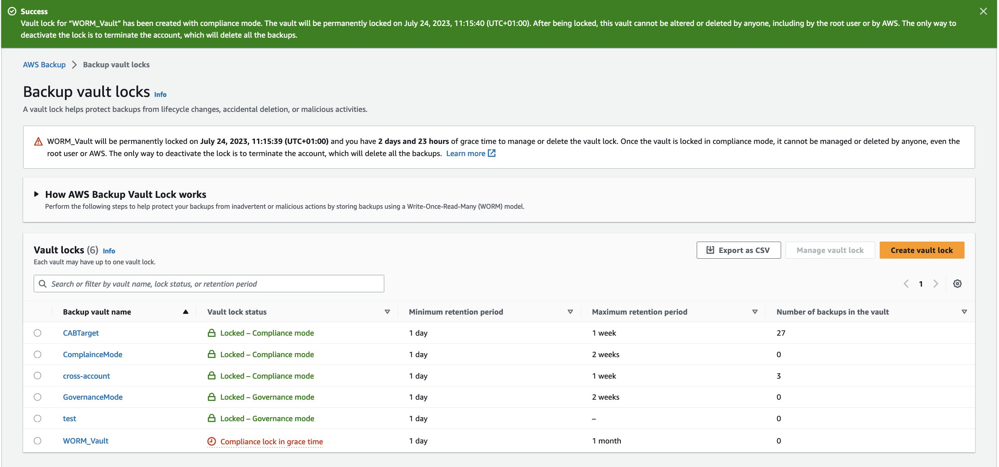

* You can also hover on the Vault lock status to check the compliance lock details. 
    

### Step4: Create on-demand backup 

The vault lock will also apply to the existing backups in the locked vault. All new backup or copy jobs within the vault with retention periods shorter than the specified minimum retention period or greater than the maximum retention period will fail.

**Step 4.1 - Configure the services used with AWS Backup**

* In the navigation pane on the left of the console, choose **Settings**.
* On the **Service opt-in** page, choose the **Configure resources** button.

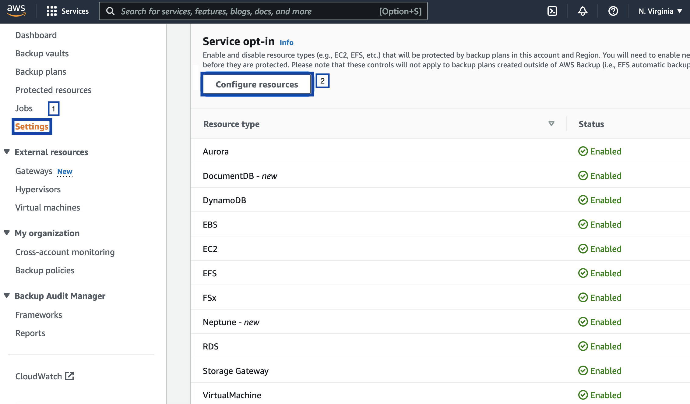

* On the **Configure resources** page, use the toggle switches to enable or disable the services used with AWS Backup. In this case, select EBS. Choose **Confirm** when your services are configured. 

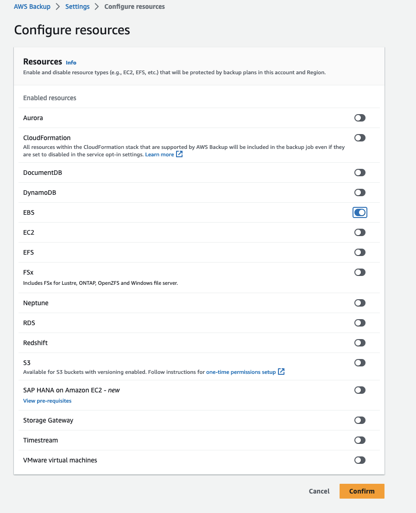

**4.2 - Create an on-demand backup job of an Amazon EBS volume**

* Navigate to [AWS Backup console](https://console.aws.amazon.com/backup), under **My account**, select **Protected resources** in the left navigation pane. Then choose the **Create on-demand backup** button.

* On the **Create on-demand backup** page, choose the **Resource type** that you want to back up; for example, choose EBS for Amazon EBS volume
* Choose the volume id of the EBS resource that you want to protect.
* In the **Backup window** section, select **Create backup now**. This initiates a backup immediately and enables you to see your saved resource sooner on the **Protected resources** page.
* In the **Retention period** section, select **Days** and enter the number of days you want to retain the backups for. In this example, I choose 7 days.
 
 **Note:** Only backup jobs within the retention periods will be successful. In this example, we set the min retention to 1 days and your max retention to 30 days. So, any job creation after 30 days, will fail.

* In the **Backup vault** section, select the locked vault. In this example, we choose ‘WARM_Vault.
* choose the **Default role** for **IAM role**, as shown in the following screenshot, or **Choose an IAM role**. 

**Note:** If the AWS Backup **Default role** is not present in your account, one will be created for you with the correct permissions.

* Choose the **Create on-demand backup** button. This takes you to the **Jobs** page, where you will see a list of jobs.

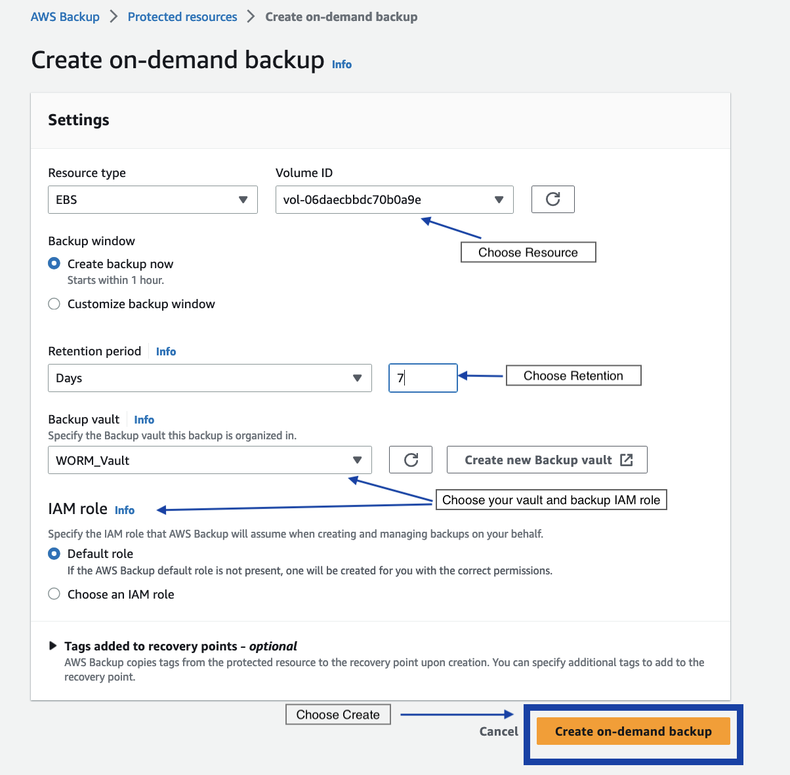

**4.3 - Checking job details**

* In the **Jobs** panel under **My account**, ensure the **Backup jobs** tab is selected. 
* Choose the **Backup job ID** for the resource that you chose to back up to see the details of that job.
* After some time, the **Status** of the backup job will go from **Created** to **Completed**.

### Step5 - Validating Vault lock capabilities

Once the job is completed, click the **Recovery point ARN**, this will open a new page in the backup vault with the details of the recovery point. 

**5.1 Deleting the the backup:** 

At this point, you have enabled Backup Vault Lock, so if you try to delete the recovery point it should fail.

 * On the recovery point details page, choose Delete.

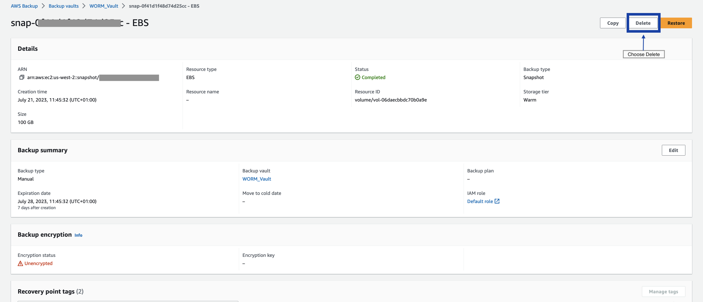

* A conformation pops up to confirm if you want to delete the recovery point.
* Choose confirm for deleting the recovery point

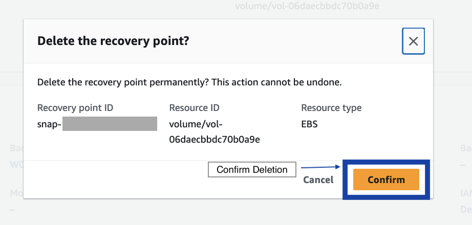

* Once you choose confirm, it delete operation would result in the error banner ‘RecoveryPoint cannot be deleted or updated (Backup vault configured with Lock).’ This is because the vault is locked.

**5.2 - Updating retention period of the recovery point**
Backup Vault Lock also protects any modifications to lifecycle of a backup

*  Under **Backup summary** of the recovery point, choose **Edit** to modify the retention setting of the recovery point

* Modify the retention period from 7 days to 14 days

* Select **Save**, you will receive the following error.

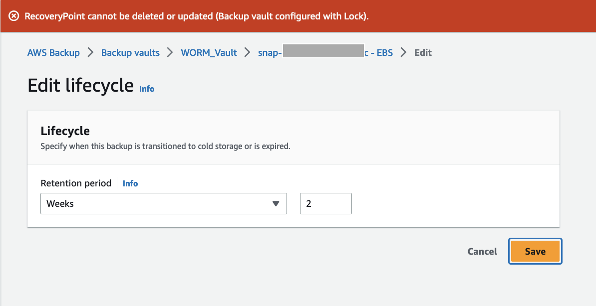
    
**Clean up:**

To clean up after this demonstration to avoid unintended charges, I remove the backup vault lock setting from the backup vault. I complete this action since I set a 3-day grace period when I created the vault.

* To delete the backup vault lock setting from the backup vault, navigate to **Backup vault locks in the left navigation plane** , select **Manage Vault lock**

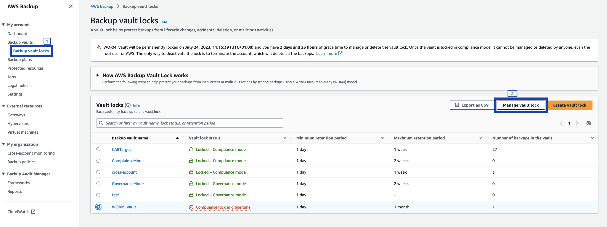

* Alternatively, you can also manage the vault lock settings directly from the vault as well.

* Select **Delete vault lock** to delete the lock on the Backup Vault.

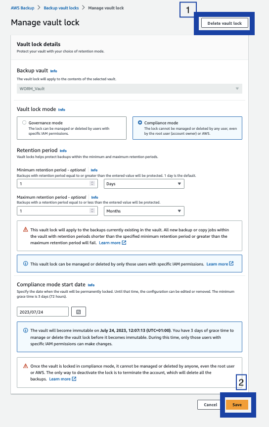

* Confirm the deletion of the vault lock and select Confirm.

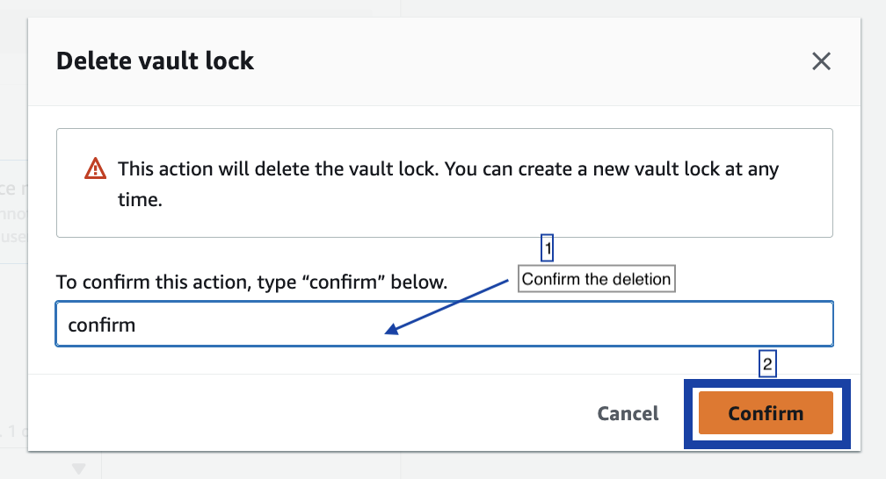

* As we confirm, it will re-direct you to the **Manage Vault lock page** which will have a banner showing the success of the operation. 

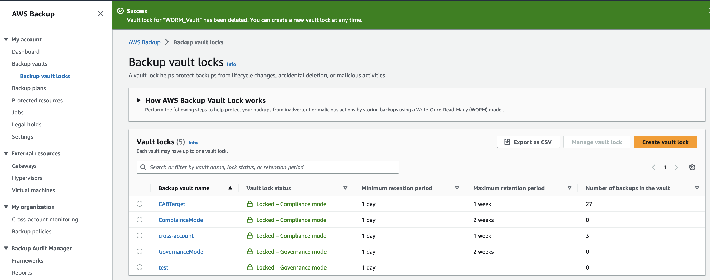

### Next steps

Congratulations! In this tutorial, you learnt how to enable AWS Backup Vault Lock on your backup vaults. You also learnt how to validate that backups protected by this feature are truly immutable and cannot be deleted and how backups cannot have their retention or storage lifecycle modified when protected by this capability.
